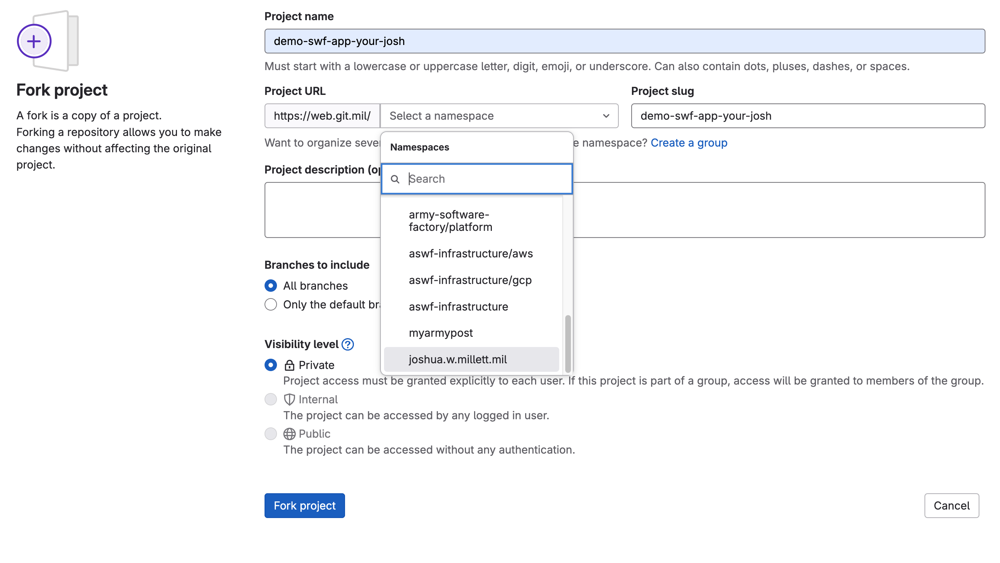
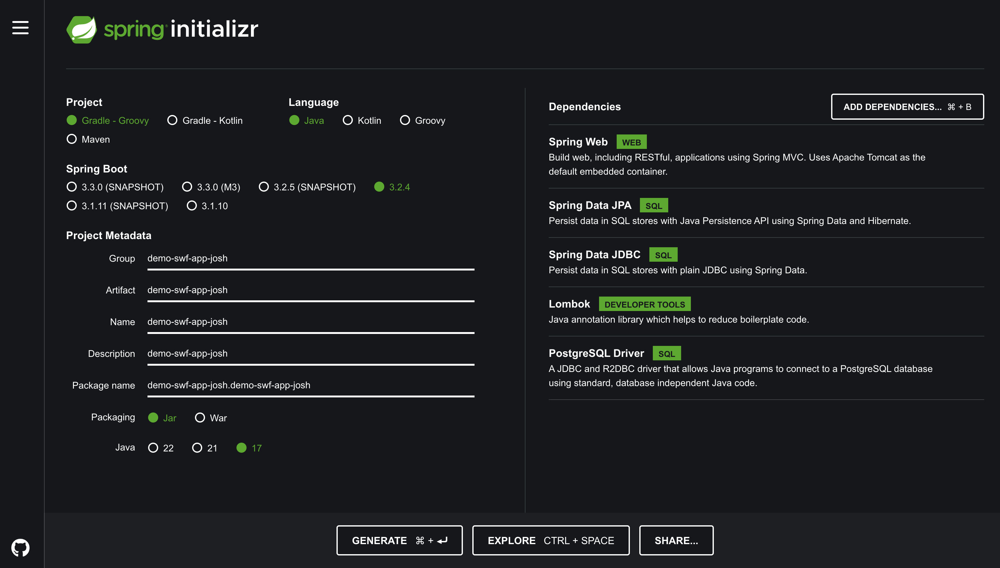

# Container Orchestration

## Project Setup

### `Part I - Git Repository Setup`

- Fork the repo in Gitlab named `demo-swf-app-<your-name>` and clone it down locally. Change directory to the root of the project:

https://web.git.mil/swf/bridge-program/platform-bridge/demo-swf-app-your-name

<p align="center">
  
</p>

<p align="center">
  
</p>

### `Part II - Springboot Backend Setup`

Bootstrap a SpringBoot Project:

- Navigate to `start.spring.io` and generate a project with the following settings:
`Note:` changed my name to your name:

<p align="center">
  
</p>

- Unzip the file contents. The files below should be present:

<p align="center">
  
</p>

- Copy the files into your git repository folder created in earlier steps:

- `Note`, to make your life easier, only copy the contents of the root folder, and the not the root folder itself.

<p align="center">
  
</p>

- The folder structure should look like the image below, with the exception of the name:
- `Update`: there will be a couple of pre-staged files not pictured:

```
- app-logo/<swf image for the app>
- img/<images used for readme>
- app-manifests/<blank kubernetes manifests to add content to later>
- postgres/<helm files for postgres helm deployment>
- .dockerignore # used to ignore these files when building a docker container
```


<p align="center">
  
</p>


### `Database Setup`

Configure Postgres:

- Install:

https://formulae.brew.sh/formula/postgresql@16
```shell
brew install postgresql@16
```

- Verify connectivity to the local database. Connect to the database:

```shell
# if using mac
psql postgres

# if using linux
sudo -u postgres psql
```
Run the following SQL commands to do the following:
- Create a user and set a default password
- Give the user admin privileges.
- Create the table used for the project called `soldier` and and column with the primary key of `id`, and two columns in the table called `name`, and `rank`: This will be used later to insert, and delete soldier information from a simple table:

```sql
CREATE USER postgres WITH PASSWORD 'postgres';
ALTER USER postgres WITH SUPERUSER;
CREATE TABLE soldier( id SERIAL PRIMARY KEY, name VARCHAR(30), rank VARCHAR(30));
```

<p align="center">
  
</p>


Exit the database:

```shell
exit
```

- Now, run our Spring Boot app using the `./gradlew bootRun` command, and connect to the database (`it should fail`) because we have not setup the proper connection in `src/main/resources/application.properties`:

```shell
# set permissions if needed
chmod +x gradlew

./gradlew bootRun
```

Build failed is expected!

<p align="center">
  
</p>

In vscode, locate the following file: src/main/resources/application.properties:

- Next, open the `application.properties` file, and overwrite the following key-value pairs to the existing configuration:

`Note`: again your application name will be different!

```
spring.application.name=demo-swf-app-test
spring.datasource.url=jdbc:postgresql://localhost:5432/postgres
spring.datasource.username=postgres
spring.datasource.password=postgres
spring.datasource.driver-class-name=org.postgresql.Driver
spring.jpa.properties.hibernate.dialect=org.hibernate.dialect.PostgreSQLDialect
spring.jpa.hibernate.ddl-auto=update
```

Take a look at this file, and study the values that are set here.

- Now, we are going to create `two` new `yaml` files, one to connect to our local postgres database, and one to connect to our database that will run in a kubernetes cluster. These two yaml files, perform the same function as the `application.properties` file, so we will now delete that file and create two new files:

```
- application-prod.yaml         
- application-local.yaml
```

Note the naming convention of the files (`prod`, `local`). 

A feature we are going to implement called `SPRING_PROFILES_ACTIVE` will recognize the file it needs to reference/use, based on the corresponding environment we are using (prod or local). We will see more on that in a later section. For now, create the two files:

- Local database connection:

```yaml
spring:
  application:
    name: demo-swf-app-test
  datasource:
    url: jdbc:postgresql://localhost:5432/postgres
    username: postgres
    password: postgres
    driver-class-name: org.postgresql.Driver
  jpa:
    properties:
      hibernate:
        dialect: org.hibernate.dialect.PostgreSQLDialect
    hibernate:
      ddl-auto: update
```

- Kubernetes postgres database connection: (change test, to your name)

```yaml
spring:
  application:
    name: demo-swf-app-test
  datasource:
    url: jdbc:postgresql://postgresql.demo-swf-app-test:5432/postgres
    username: postgres
    password: postgres
    driver-class-name: org.postgresql.Driver
  jpa:
    properties:
      hibernate:
        dialect: org.hibernate.dialect.PostgreSQLDialect
    hibernate:
      ddl-auto: update
```

- Next, we will modify our `build.gradle` file located in the root directory to do the following:

```
- Adding Correct Dependencies
- Adding Spring Profiles
- Adding Build Tasks (Steps in the correct order)
```

Modify the `build.gradle` file by over-writing with the following contents: into your `build.gradle` file:

Note: change the `group` to your group:

```
plugins {
    id 'java'
    id 'org.springframework.boot' version '3.2.4'
    id 'io.spring.dependency-management' version '1.1.4'
}

group = 'demoswfapptest'
version = '0.0.1-SNAPSHOT'
sourceCompatibility = '17'

repositories {
    mavenCentral()
}

dependencies {
    compileOnly 'org.projectlombok:lombok:1.18.22'
    annotationProcessor 'org.projectlombok:lombok:1.18.22'
    implementation 'org.springframework.boot:spring-boot-starter-web'
    implementation 'org.springframework.boot:spring-boot-starter-data-jpa'
    runtimeOnly 'org.postgresql:postgresql'
    testImplementation 'org.springframework.boot:spring-boot-starter-test'
    implementation 'com.fasterxml.jackson.core:jackson-databind'
}

// Task to install frontend dependencies
task installFrontend(type: Exec) {
    inputs.file(file("./frontend/package-lock.json"))
    inputs.file(file("./frontend/package.json"))
    commandLine("npm", "install", "--prefix", "frontend")
    doLast {
        println("We Install")
    }
}

// Task to build frontend
task buildFrontend(type: Exec) {
    dependsOn("installFrontend")
    inputs.dir(file("frontend"))
    outputs.dir(file("frontend/build"))
    commandLine("npm", "run", "build", "--prefix", "frontend")
    doLast {
        println("We built")
    }
}

task copyFrontend(type: Sync) {
    dependsOn("buildFrontend")
    from(file("./frontend/build"))
    into(file("$buildDir/resources/main/static"))
    doLast {
        println("copied built frontend to static resources")
    }
}

tasks.resolveMainClassName {
    dependsOn tasks.copyFrontend
}

jar {
    dependsOn copyFrontend
}

// Define cleanFrontend task
task cleanFrontend(type: Delete) {
    delete(file("./frontend/build"))
    delete(file("./src/main/resources/static"))
}

bootRun {
    systemProperty "spring.profiles.active", "local" // Set the active profile here
}


// Make clean depend on cleanFrontend
clean.dependsOn cleanFrontend

// Explicitly declare resolveMainClassName depends on copyFrontend
tasks.resolveMainClassName.dependsOn copyFrontend

// Explicitly declare compileTestJava depends on copyFrontend
tasks.compileTestJava.dependsOn copyFrontend


bootRun {
    systemProperty "spring.profiles.active", "local" // Set the active profile here
}
```

We will now verify the application boots and connects to the database:

- Check to see if the backend `springboot` application can connect properly to the `postgres` database:

```shell
./gradlew bootRun
```

- The following output means you have successfully established a connection to the postgres database (`HikariPool`), Tomcat server on port 8080 has started, and `bootRun` is steadily run at `80% EXECUTING`:

<p align="center">
  
</p>


### `Frontend Setup`

To bootstrap a frontend, we will use `React`.

- Bootstrap a react project:

While in the root folder of your project, run the following command. Notice, it will create a new folder called `frontend` containing your frontend project files:

```shell
npx create-create-app frontend
# note: you may need to install node to do this
```

<p align="center">
  
</p>

```shell
cd frontend/
```

<p align="center">
  
</p>

- Test to see if your frontend runs correctly:

```shell
npm run start
```

- Navigate to `localhost:3000` to verify.

- At this point you've bootstrapped a react frontend, a spring boot backend, and a postgres database. Let's now make an application!

### Creating a Functioning Application to Containerize

`Disclaimer:` The purpose of this class is `containerization` and `familiarizing` with the structure of Software factory applications, and how the different components (`frontend, backend, database`) interact with one-another. At times, troubleshooting outages relies on understanding how application connections work.

At this time, we will briefly describe, then copy and paste code into each file, to demonstrate how it works, but we will not be deep diving into how to program in java or react!

####  Backend setup

In the `src/main/java/demoswfappjoshua/demoswfappjoshua` folder, create three directories:

Note: you path will be named based on the name you used to bootstrap your spring boot application. Let us now create the folder and file structure:

```
- controller
- model
- repository
```

In each folder, create the following files:

```
/controller/SoldierController.java
/model/Soldier.java
/repository/SoldierRepository.java
```

#### Create the `SoldierController.java`

Add the following code to the `SoldierController.java` file, but `replace test` in the package name and imports with `your name` on all occurrences:

```java
package demoswfapptest.demoswfapptest.controller;

import demoswfapptest.demoswfapptest.model.Soldier;
import demoswfapptest.demoswfapptest.repository.SoldierRepository;
import lombok.AllArgsConstructor;
import org.springframework.http.ResponseEntity;
import org.springframework.web.bind.annotation.*;

import java.util.List;

@RestController
@AllArgsConstructor
@RequestMapping("/api/soldier") // Base mapping for all methods in this controller
public class SoldierController {
    private final SoldierRepository soldierRepository;

    @GetMapping("/home")
    public String home() {
        return "Demo CRUD App Deployment Class for Cohort 7";
    }

    @PostMapping("/post")
    public ResponseEntity<Void> insertSoldier(@RequestBody Soldier soldier) {
        System.out.println("Received Soldier: " + soldier);

        soldierRepository.save(soldier);
        return ResponseEntity.noContent().build();
    }

    @GetMapping("/list")
    public ResponseEntity<List<Soldier>> getAllSoldier() {
        List<Soldier> soldierList = soldierRepository.findAll();
        return ResponseEntity.ok().body(soldierList);
    }

    @DeleteMapping("/delete") 
    public ResponseEntity<Void> deleteSelectedSoldiers(@RequestBody List<Long> soldierIds) {
        soldierIds.forEach(id -> {
            soldierRepository.deleteById(id);
        });
        return ResponseEntity.noContent().build();
    }
}
```

- The above `SoldierController class` is a part of a Spring Boot application, designed to handle `HTTP requests` related to Soldier entities. The `SoldierController class` utilizes the `SoldierRepository` for database operations. It follows `RESTful` conventions for `CRUD` operations:

```
POST for creating new resources (insertSoldier)
GET for reading resources (getAllSoldier)
DELETE for deleting resources (deleteSelectedSoldiers)
```

- The controller requires the following dependencies:

`Spring Boot:` A Java-based framework for building web applications.
`Lombok:` A library to reduce boilerplate code in Java classes, used here for `@AllArgsConstructor` to generate a constructor with all fields.

- Below is an explanation of its main functionalities:

`Base Mapping:` All endpoints in this controller are based on the `/api/soldier` path.

`GET /api/soldier/home` Returns a simple message.

`POST /api/soldier/post`:  Sends a `POST` request with a `JSON` body representing a Soldier entity. The Soldier will be saved to the database.

```json
{
  "id": 1,
  "name": "John Doe",
  "rank": "Captain"
}
```

`GET /api/soldier/list`: Fetches all Soldier entities from the database using the SoldierRepository. Making a `GET` request to this endpoint will return a JSON array of all Soldiers in the list:
```json
[
  {
    "id": 1,
    "name": "John Doe",
    "rank": "Captain"
  },
  {
    "id": 2,
    "name": "Jane Smith",
    "rank": "Lieutenant"
  }
]
```

`DELETE /api/soldier/delete`: Sends a `DELETE` request with a JSON body containing an array of Soldier IDs to delete.


```json
[1, 2, 3]
```

#### Create the `Solder.java` file:

Add the following code to the model `Soldier.java`, but replace test in the package name with your name on all occurrences:

```java
package demoswfapptest.demoswfapptest.model;
import lombok.*;

import java.io.Serializable;

import jakarta.persistence.Entity;
import jakarta.persistence.GeneratedValue;
import jakarta.persistence.GenerationType;
import jakarta.persistence.Id;
import jakarta.persistence.Table;

@Entity(name="Soldier")
@Table(name="soldier")
@AllArgsConstructor
@NoArgsConstructor
@Getter
@Setter
public class Soldier implements Serializable{
    @Id
    @GeneratedValue(strategy = GenerationType.IDENTITY)
    private Long id;

    private String name;

    private String rank;
}
```

The `Soldier entity class` above is an java entity that represents a row that will be inserted, listed, or deleted from our database. Here are a few items in the Soldier entity to be aware of:

- `Table Name:` soldier (table that will be queried)
- `Entity Name:` Soldier (name of our entity)

- `id (Long):` field to insert data into
- `name (String):` field to insert data into
- `rank (String):` field to insert data into

Uses the dependencies:
- `Jakarta Persistence (JPA):` Standard for persisting Java objects in relational databases.
- `Lombok:` A library to reduce boilerplate code in Java classes, used here for generating constructors and getter/setter methods.


#### Create the `SolderRepository.java` file:

Add the following code to the model `SoldierRepository.java`, but replace my name in the package name with your name on all occurences:

```java
package demoswfapptest.demoswfapptest.repository;

import org.springframework.data.jpa.repository.JpaRepository;
import org.springframework.stereotype.Repository;

import demoswfapptest.demoswfapptest.model.Soldier;

@Repository
public interface SoldierRepository extends JpaRepository<Soldier, Long> {
}
```

- The `SoldierRepository interface` is a part of a Spring Boot application, serving as a repository for the Soldier entity. `Handles database operations` for the Soldier entity. By extending JpaRepository<Soldier, Long>, the SoldierRepository gains access to methods like `save`, `findById`, `findAll`, `deleteById`, `etc.`, without needing to implement these methods manually.

- `Spring Data JPA`: Provides an easy and efficient way to interact with the database without writing boilerplate code.

- The `SoldierRepository interface` can be used to perform CRUD operations on the Soldier entity.

At this time, your backend code should be setup! Let us test it to see if it works:

Next, let us `manually` enter a row into the soldier table:

```shell

# login to pg
psql postgres

\c postgres # make sure we are connected to the right db

# insert a row into the database
INSERT INTO soldier (name, rank) VALUES ('your-name', 'your-rank');

# verify the transaction took place
SELECT * FROM soldier;
```

Now, run the backend application to verify that the backend queries the database:

```shell
./gradle bootRun
```

Navigate to:

```
http://localhost:8080/api/soldier/list (you should see a list of rows)

  # you should see: [{"id":1,"name":"your-name","rank":"your-rank"}]

http://localhost:8080/api/soldier/home (you should see a simple message)

  # you should see: Demo CRUD App Deployment Class for Cohort 7
```

Your app is now connected to your database!

### Frontend

To set up the frontend, were going to replace some of the boilerplate code we generated earlier, with our own. Replace the content of the following files:

`frontend/src/App.js`

```js
import React, { useState, useEffect } from 'react';
import axios from 'axios';
import './App.css';
import LogoImage from './download.jpg';

const baseUrl = process.env.API_BASE_URL || 'http://localhost:8080/api/soldier';

const Logo = () => (
  <div className="LogoContainer">
    
  </div>
);

const App = () => {
  const [soldiers, setSoldiers] = useState([]);
  const [name, setName] = useState('');
  const [rank, setRank] = useState('');
  const [selectedSoldiers, setSelectedSoldiers] = useState([]);
  const [showTable, setShowTable] = useState(false);
  const [isFormValid, setIsFormValid] = useState(false); // New state for form validation

  useEffect(() => {
    fetchSoldiers();
  }, []);

  useEffect(() => {
    // Check if both name and rank are filled
    setIsFormValid(name.trim() !== '' && rank.trim() !== '');
  }, [name, rank]);

  const fetchSoldiers = async () => {
    try {
      const response = await axios.get(`${baseUrl}/list`);
      setSoldiers(response.data);
      setShowTable(true);
    } catch (error) {
      console.error('Error fetching data:', error);
    }
  };

  const handleSubmit = async (e) => {
    e.preventDefault();
    if (!name || !rank) {
      alert('Please fill in all fields');
      return;
    }

    try {
      const response = await axios.post(`${baseUrl}/post`, { name, rank });
      console.log('Data submitted:', response.data);
      fetchSoldiers(); // Refresh soldiers after submission
      setName('');
      setRank('');
    } catch (error) {
      console.error('Error submitting data:', error);
    }
  };

  const handleCheckboxChange = (id) => {
    const currentIndex = selectedSoldiers.indexOf(id);
    const newSelected = [...selectedSoldiers];

    if (currentIndex === -1) {
      newSelected.push(id);
    } else {
      newSelected.splice(currentIndex, 1);
    }

    setSelectedSoldiers(newSelected);
  };

  const handleDeleteSelected = async () => {
    try {
      const response = await axios.delete(`${baseUrl}/delete`, {
        data: selectedSoldiers // Send selected IDs as the request body
      });
      console.log('Delete response:', response.data);
      fetchSoldiers(); // Refresh soldiers after deletion
      setSelectedSoldiers([]); // Clear selected soldiers
    } catch (error) {
      console.error('Error deleting data:', error);
    }
  };

  return (
    <div className="App">
      <div className="App-body">
        {/* Logo Component */}
        <Logo />
        <div className="FormContainer">
          <h2>Add Soldier</h2>
          <form onSubmit={handleSubmit} className="SoldierForm">
            <label className="FormLabel">
              Enter Name:
              <input
                type="text"
                value={name}
                onChange={(e) => setName(e.target.value)}
                className="FormInput"
                required
              />
            </label>
            <br />
            <label className="FormLabel">
              Enter Rank:
              <input
                type="text"
                value={rank}
                onChange={(e) => setRank(e.target.value)}
                className="FormInput"
                required
              />
            </label>
            <br />
            <button type="submit" className="FormButton" disabled={!isFormValid}>
              Add Soldier
            </button>
          </form>
        </div>
        {showTable && (
          <div className="TableContainer">
            <h2>Soldier List</h2>
            <table className="SoldierTable">
              <thead>
                <tr>
                  <th>ID</th>
                  <th>Name</th>
                  <th>Rank</th>
                  <th>Delete</th>
                </tr>
              </thead>
              <tbody>
                {soldiers.map(soldier => (
                  <tr key={soldier.id}>
                    <td>{soldier.id}</td>
                    <td>{soldier.name}</td>
                    <td>{soldier.rank}</td>
                    <td>
                      <input
                        type="checkbox"
                        checked={selectedSoldiers.includes(soldier.id)}
                        onChange={() => handleCheckboxChange(soldier.id)}
                      />
                    </td>
                  </tr>
                ))}
              </tbody>
            </table>
            <button onClick={handleDeleteSelected} className="deleteButton" disabled={selectedSoldiers.length === 0}>
              Delete Selected
            </button>
          </div>
        )}
      </div>
    </div>
  );
};

export default App;
```

The above `React` application (`App.js`) is a simple soldier management system:

- The application utilizes an `or` statement to either connect to `localhost:8080/api/soldier`, or an environment variable called `API_BASE_URL`, which gets mounted inside a `docker` container at runtime. If that environment variable does not exist, it will connect to localhost. Spring profiles active will determine what environment to run based on this condition. More on how this gets set in the container later.

The frontend `App.js` consists of components that allow:

- Users to input a Soldier's name and rank into the form.
Upon submission, the Soldier java object is added to the system via a POST request to http://localhost:8080/api/soldier/post. (if using local spring profile)

- Upon mounting, the component fetches the list of soldiers from the backend API (`http://localhost:8080/api/soldier/list`) (if using local spring profile). The list of soldiers is displayed in a table format.

- Users can select Soldiers by checking the checkboxes in the table rows (selectedSoldiers state). Users can select one or more Soldiers by checking the checkboxes. Clicking the "Delete Selected" button triggers a POST request to http://localhost:8080/api/soldier/delete, (if using local spring profile) sending the IDs of selected Soldiers to be deleted. This will delete the java objects from the database.

Styling the page: Replace the content of the following files:

`frontend/src/App.js` Do not focus on this, its just to make the app pretty.

```css
body {
  margin: 0;
  font-family: -apple-system, BlinkMacSystemFont, 'Segoe UI', 'Roboto', 'Oxygen',
    'Ubuntu', 'Cantarell', 'Fira Sans', 'Droid Sans', 'Helvetica Neue',
    sans-serif;
  -webkit-font-smoothing: antialiased;
  -moz-osx-font-smoothing: grayscale;
  background-color: #000000; /* Dark background similar to GitHub's dark mode */
  color: #c9d1d9; /* Text color */
}

.App {
  text-align: center;
  padding-bottom: 15px;
  min-height: 100vh;
  display: flex;
  flex-direction: column;
  align-items: center;
  justify-content: center;
}

.App-header {
  background-color: #000000; /* Dark header background */
  min-height: 15vh;
  display: flex;
  flex-direction: column;
  align-items: center;
  justify-content: center;
  font-size: calc(10px + 2vmin);
  color: #bdb000; /* Header text color */
  width: 100%;
}

.App-logo {
  height: 20vmin;
  pointer-events: none;
  border: 1px solid #30363d;
}

.App-body {
  display: flex;
  flex-direction: column;
  align-items: center;
  justify-content: center;
}

.FormContainer {
  max-width: 300px;
  width: 100%;
}

.SoldierForm {
  margin-top: 20px;
}

.FormLabel {
  margin-right: 10px;
}

.FormInput {
  width: 100%;
  padding: 10px; 
  font-size: 16px;
  border: 1px solid #30363d; 
  border-radius: 4px;
  box-sizing: border-box;
  background-color: #0d1117; 
  color: #ccc900; 
}

.FormButton {
  width: 100%;
  margin-top: 10px;
  padding: 10px;
  font-size: 16px;
  background-color: #252525; 
  color: white;
  border: none;
  border-radius: 4px;
  cursor: pointer;
}

.FormButton:hover {
  background-color: #beb200;
}

.TableContainer {
  margin-top: 2px;
  padding: 10px;
}

.SoldierTable {
  width: 100%;
  border-collapse: collapse;
  margin-top: 2px;
}

.SoldierTable th,
.SoldierTable td {
  border: 1px solid #30363d;
  padding: 8px;
  text-align: center; 
  border-radius: 8px; 
  width: 2in; 
}

.SoldierTable th {
  background-color: #181818; 
  color: #c9d1d9; 
}


.deleteButton {
  background-color: #b3a100; 
  color: white;
  padding: 8px 16px;
  border: none;
  border-radius: 4px;
  cursor: pointer;
  margin-top: 10px;
}

.deleteButton:disabled {
  background-color: #30363d; 
  color: #6a737d; 
}

.LogoContainer {
  text-align: center; 
}

.LogoImage {
  width: 100px; 
  height: auto; 
}
```

`Verify the functionality of the frontend`:

```shell
cd frontend/
```
```shell
# install the axios node module

npm install axios
```

Axios is used to make asynchronous HTTP requests to the backend API.
- axios.get is used to fetch the list of soldiers.
- axios.post is used to add a new Soldier.
- axios.delete is used to delete selected Soldiers.


There is a image called `download.jpg` located in the app-logo/download.jpg folder: Drag it into the following folder (the same folder the App.js is in):

```
app-logo/download.jpg > frontend/src/download.jpg
```

The app will not compile correctly if this image is not moved. Its simply the Software Factory logo.

Let us now run the application frontend to verify it works correctly:

```shell
npm start

# navigate to see the static page (no data will be displayed yet, until the backend and frontend are built and packaged in an uber jar together.)

# Verify App.js and App.css are functional ()

http://localhost:3000/
```

`Update`: added more css and logo (image is slightly different)

<p align="center">
  
</p>

### Connect the Front and Backends

Now we will connect the front and backends. Let's start by adding new tasks to our gradle build file.

 These tasks will:
 - install any dependencies need for the frontend
 - build the frontend
 - copy the frontend to the correct backend gradle location to be built into an uber jar
 - then clean the front end folder

 These tasks will be executed when running the `./gradlew build` or `./gradlew bootRun` commands, and will essentially generate an uberjar with the front and backend packaged together. At this time, feel free to copy the entire gradle.build file from the demo repo into your build.gradle file. 

 `Important`: replace the group name, with your group name:

 ```java
plugins {
    id 'java'
    id 'org.springframework.boot' version '3.2.4'
    id 'io.spring.dependency-management' version '1.1.4'
}

group = 'demoswfapptest'
version = '0.0.1-SNAPSHOT'
sourceCompatibility = '17'

repositories {
    mavenCentral()
}

dependencies {
    compileOnly 'org.projectlombok:lombok:1.18.22'
    annotationProcessor 'org.projectlombok:lombok:1.18.22'
    implementation 'org.springframework.boot:spring-boot-starter-web'
    implementation 'org.springframework.boot:spring-boot-starter-data-jpa'
    runtimeOnly 'org.postgresql:postgresql'
    testImplementation 'org.springframework.boot:spring-boot-starter-test'
    implementation 'com.fasterxml.jackson.core:jackson-databind'
}

task installFrontend(type: Exec) {
    inputs.file(file("./frontend/package-lock.json"))
    inputs.file(file("./frontend/package.json"))
    commandLine("npm", "install", "--prefix", "frontend")
    doLast {
        println("We Install")
    }
}

task buildFrontend(type: Exec) {
    dependsOn("installFrontend")
    inputs.dir(file("frontend"))
    outputs.dir(file("frontend/build"))
    commandLine("npm", "run", "build", "--prefix", "frontend")
    doLast {
        println("We built")
    }
}

task copyFrontend(type: Sync) {
    dependsOn("buildFrontend")
    from(file("./frontend/build"))
    into(file("$buildDir/resources/main/static"))
    doLast {
        println("copied built frontend to static resources")
    }
}

tasks.resolveMainClassName {
    dependsOn tasks.copyFrontend
}

jar {
    dependsOn copyFrontend
}

task cleanFrontend(type: Delete) {
    delete(file("./frontend/build"))
    delete(file("./src/main/resources/static"))
}

bootRun {
    systemProperty "spring.profiles.active", "local"
}

clean.dependsOn cleanFrontend

tasks.resolveMainClassName.dependsOn copyFrontend

tasks.compileTestJava.dependsOn copyFrontend

```

Run the following command and navigate to localhost:8080 to view the application:


```shell
./gradlew bootRun
```

Congratulations, you built a CRUD app, similar to the ones we deploy into our environment. Now we'll containerize it and deploy it on Kubernetes!

### `Part VI - Containerize the application`

Create a dockerfile with the following contents:

```Dockerfile
FROM openjdk:17-jdk-slim AS build
WORKDIR /app
COPY . .

RUN apt-get update
RUN apt-get install -y npm
RUN ./gradlew build

# Stage 2: Create the final image
FROM openjdk:17-jdk-slim
WORKDIR /app
COPY --from=build /app/build/libs/demo-swf-app-josh-0.0.1-SNAPSHOT.jar app.jar
EXPOSE 8080
CMD ["java", "-jar", "app.jar"]
```

### Create the Kubernetes Objects

Start a local kubernetes cluster:

```shell
minikube start
```

Setup the folder and file structure to generate helm templates and kubernetes objects:

```shell
mkdir -p ./manifests/postgresql/helm/template ./manifests/apps/ ./manifests/scripts
file1='./manifests/scripts/create-deployment-files.sh' && \
[[ ! -f "${file}" ]] && touch "${file}" || echo "The file: ${file} already exists"
```

Add the following contents to the `./manifests/scripts/create-deployment-files.sh` file you just create. This will create blank files for you, check file if they already exists:


```shell
#!/bin/bash

#!/bin/bash

# Array of file paths
declare -A files=(
    [file1]='../manifests/postgresql/helm/generate-template.sh'
    [file2]='../postgresql/helm/values.yaml'
    [file3]='../postgresql/helm/template/postgresql-template.yaml'
    [file4]='../postgresql/helm/template/namespace.yaml'
    [file5]='../postgresql/helm/template/deployment.yaml'
)

# Function to create file if it doesn't exist
create_file_if_not_exist() {
    local file_path="$1"
    if [ ! -f "$file_path" ]; then
        touch "$file_path"
        echo "Created: $file_path"
    else
        echo "Skipped (File already exists): $file_path"
    fi
}

# Loop through the array and create files
for key in "${!files[@]}"; do
    create_file_if_not_exist "${files[$key]}"
done

```

Execute the script to create the files:

```shell
chmod +x ./manifests/scripts/create-deployment-files.sh \
./manifests/scripts/create-deployment-files.sh
```

`generate-manifest.sh`

```shell
#!/bin/bash

set -euo pipefail

RED=$(tput setaf 1)
GREEN=$(tput setaf 2)
NC=$(tput sgr0)

# ERROR PRINTING FUNCTION
exit_with_error() {
  printf "%sError: %s%s\n" "$RED" "$1" "$NC" >&2
  exit 1
}

# ONLY MODIFY THESE VARIABLES
export DESIRED_NAMESPACE='demo-swf-app-test'
export APP_NAME='postgresql'
export HELM_TEMPLATE_VERSION='15.1.4'
export HELM_REPO_FOLDER="bitnami"
export HELM_REPO="https://charts.bitnami.com/bitnami"

# STATIC VARIABLES
export FOLDER_NAME="$APP_NAME"
export HELM_TEMPLATE_NAME="$APP_NAME"
export HELM_TEMPLATE_FILE_NAME="template/${APP_NAME}-template.yaml"
export HELM_VALUES_FILE_NAME="values.yaml"

# INPUT CHECKING
[[ -n "${APP_NAME}" ]] || exit_with_error "APP_NAME is not set"
[[ -n "${HELM_TEMPLATE_NAME}" ]] || exit_with_error "HELM_TEMPLATE_NAME is not set"
[[ -n "${HELM_TEMPLATE_VERSION}" ]] || exit_with_error "HELM_TEMPLATE_VERSION is not set"
[[ -n "${HELM_VALUES_FILE_NAME}" ]] || exit_with_error "HELM_VALUES_FILE_NAME is not set"
[[ "${HELM_REPO}" =~ ^https:// ]] || exit_with_error "Invalid HELM_REPO URL. It must start with 'https://'."
[[ -n "${HELM_REPO_FOLDER}" ]] || exit_with_error "Helm repository folder is not specified (empty)."

# CHECKING IF HELM REPO EXISTS LOCALLY
[[ $(helm repo list | grep -c "${HELM_REPO_FOLDER}") -gt 0 ]] && {
  printf "${GREEN}Adding Helm Repo...\n"
  printf "Skipping: ${NC}The ${HELM_REPO_FOLDER} ${APP_NAME} helm repository already exists...\n"
} || {
  helm repo add "${HELM_REPO_FOLDER}" "${HELM_REPO}" && helm repo update || \
  exit_with_error "Failed to add or update Helm repository"
}

# GENERATE HELM TEMPLATE
helm template "${HELM_TEMPLATE_NAME}" "${HELM_REPO_FOLDER}/${HELM_TEMPLATE_NAME}" \
  --version "${HELM_TEMPLATE_VERSION}" \
  --values values.yaml \
  --namespace "${DESIRED_NAMESPACE}" \
  > "${HELM_TEMPLATE_FILE_NAME}" || exit_with_error "Failed to generate Helm template"

# SUCCESS MESSAGE
printf "${GREEN}SUCCESS!${NC} The new ${APP_NAME} helm template is located at: ${GREEN} ${APP_NAME}/helm/${HELM_TEMPLATE_FILE_NAME}${NC}"
```


Open the following files, and replace `` with your namespace (name it the same as your app name):

```shell
./postgresql/namespace.yaml
./postgresql/pvc.yaml

# Note: PVC is not namespaced, and does not requiure a ns
```

Apply the three manifests located in the `postgresql` directory:

```
kubectl apply -f ./postgresql/namespace.yaml
kubectl apply -f ./postgresql/pv.yaml
kubectl apply -f ./postgresql/pvc.yaml
```

```shell
k exec -it postgresql-0 -n demo-swf-app-josh -- psql -U postgres
```

Run the following to generate a set of kubernetes manifests for postgres:

```shell
./postgresql/helm/generate.sh
```

Apply the manifest and verify the `postgresql-0` pod is running after a minute or so:

```shell
kubectl apply -f postgresql/helm/template/postgresql-template.yaml
```
